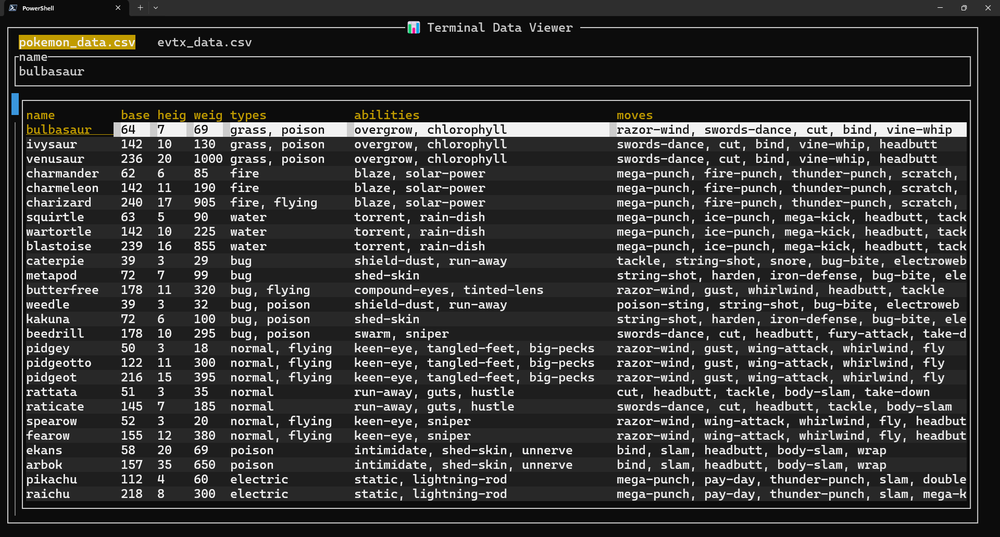

# DataTUI

A fast, keyboard‑first terminal data viewer built with Rust and Ratatui. DataTUI lets you explore CSV/TSV, Excel, and SQLite data with tabs, sorting, filtering, SQL (via Polars), and more.




## Features

- Tabbed data views with quick navigation
- CSV/TSV, Excel, and SQLite import flows
- Polars‑backed SQL queries and lazy evaluation
- Sorting, filtering (builder dialog + quick filters), column width management
- Find, Find All with contextual results, and value viewer with optional auto‑expand
- JMESPath transforms and Add Columns from expressions
- Workspace persistence (state + current views) with Parquet snapshots

## Install

From source in this repo:

```bash
cargo build --release
# binary at target/release/datatui
```

Or run locally:

```bash
cargo run --release --bin datatui
```

## Usage

```bash
datatui [--logging error|warn|info|debug|trace]
```

## Loading data with --load

Preload one or more datasets on startup by repeating `--load`. Each spec is:

`kind:path;key=value;flag`

- Multiple `--load` flags are allowed; each adds a dataset to import.
- `path` can be a file path, a glob pattern (`*`, `?`, `[abc]`), or `STDIN`/`-`.
- Bare flags without `=value` are treated as boolean `true`.

### Kinds and options

- CSV/TSV/TEXT: `text`, `csv`, `tsv`, `psv`
  - Options: `delim`/`delimiter` (`,`, `comma`, `tab`, `|`, `pipe`, `psv`, `space`, or `char:x`), `header`/`has_header` (`true|false`), `quote`/`quote_char` (char or `none`), `escape`/`escape_char` (char or `none`), `merge` (`true|false`).
  - Examples:
    - `--load 'csv:C:\\data\\sales.csv;header=true'`
    - `--load 'tsv:C:\\data\\export.tsv;header=false'`
    - `--load 'text:C:\\data\\file.txt;delim=tab;quote=none'`
    - `--load 'psv:C:\\data\\*.psv;header=true;merge=true'` (globs; merged into a temp file)

- Excel: `xlsx`, `xls`
  - Options: `all_sheets` (`true|false`, default `true`), `sheets`/`sheet` (comma list).
  - Examples:
    - `--load 'xlsx:C:\\data\\book.xlsx'` (all sheets)
    - `--load 'xlsx:C:\\data\\book.xlsx;all_sheets=false;sheets=Sheet1,Sheet3'`

- SQLite: `sqlite`, `db`
  - Options: `import_all_tables` (`true|false`), `table` (single), `tables` (comma list).
  - Examples:
    - `--load 'sqlite:C:\\db\\app.sqlite;table=users'`
    - `--load 'sqlite:C:\\db\\app.sqlite;tables=users,orders'`
    - `--load 'sqlite:C:\\db\\app.sqlite;import_all_tables=true'`

- Parquet: `parquet`
  - Options: none
  - Example: `--load 'parquet:C:\\data\\metrics.parquet'`

- JSON / NDJSON: `json`, `jsonl`, `ndjson`
  - Options: `ndjson` (`true|false`), `records` (path to array of records), `merge` (`true|false`, only for NDJSON).
  - Examples:
    - `--load 'json:C:\\data\\records.json;records=data.items'`
    - `--load 'jsonl:C:\\logs\\*.jsonl;merge=true'` (globs; merged into a temp `.jsonl`)

### Reading from STDIN

- Use `STDIN` or `-` as the path. The temp file extension is inferred from `kind` and options.
- Examples:
  - Bash: `cat data.json | datatui --load 'json:STDIN'`
  - PowerShell: `Get-Content -Raw data.json | datatui --load 'json:-'`

### Multiple datasets

Repeat `--load` to queue several datasets; they will import automatically on startup.


## Customizing key bindings
- Default user config file: `~/.datatui-config.json5`. On first run, this file is created from built‑in defaults. Override with `--config PATH`.
- Keybindings are organized by mode (grouping) like `Global`, `DataTabManager`, and per‑dialog modes. The on‑screen Instructions bar shows current keys for common actions.
- Open the Keybindings dialog, select a grouping, highlight an action, choose Start Rebinding, press your key combo, then press Enter to apply. Use Clear to remove a binding.
- Save As in the Keybindings dialog exports only the keybindings as JSON5. To make them default, save to your user config path or pass the file via `--config PATH`.

## Workspaces and persistence

When a valid workspace folder is set in Project Settings, DataTUI persists:

- State file: `datatui_workspace_state.json`
- Settings file: `datatui_workspace_settings.json`
- Current DataFrame snapshots: `.datatui/tabs/<dataset-id>.parquet`

On exit or when requested, TDV writes the current view to Parquet per tab (if applicable) so you can quickly resume where you left off.

## Development

- Rust toolchain required
- Build: `cargo build` (or `--release`)
- Run tests (if present): `cargo test`

